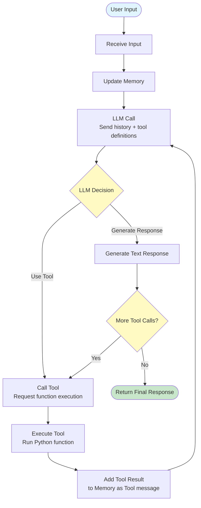

# Core Concepts

Understanding how Iris Agent works under the hood will help you build more robust applications.

## The Agent Loop

At its core, an `Agent` (or `AsyncAgent`) implements a **Loop** that continues until the AI produces a final answer.



1.  **Receive Input**: The agent accepts a user message (text or multimodal).
2.  **Update Memory**: The message is added to the agent's conversation history (`self.memory`).
3.  **LLM Call**: The agent sends the full history + available tool definitions to the LLM.
4.  **Decision**: The LLM decides to either:
    *   **Respond**: Generate a text response.
    *   **Call Tool**: Request execution of a specific tool with specific arguments.
5.  **Execution (if Tool)**:
    *   The agent executes the requested Python function.
    *   The result is captured and added to memory as a `Tool` message.
    *   The loop repeats (Go to Step 3).
6.  **Final Output**: When the LLM generates a text response (and no more tool calls), the text is returned to the user.

## Memory

Iris Agent uses a simple list-based memory structure compatible with OpenAI's chat format.

- **System Message**: The initial instruction (e.g., "You are a helpful assistant"). Always kept at index 0.
- **User Message**: Input from the human.
- **Assistant Message**: Output from the AI.
- **Tool Message**: Results from function calls.

```python
[
  {"role": "developer", "content": "You are a helpful assistant."},
  {"role": "user", "content": "What is the date?"},
  {"role": "assistant", "tool_calls": [...]},
  {"role": "tool", "tool_call_id": "...", "content": "2023-10-27"},
  {"role": "assistant", "content": "It is October 27, 2023."}
]
```

## Tools and Type Inference

One of the most powerful features of Iris Agent is how it handles tools. Instead of manually writing JSON schemas, you write standard Python functions with type hints.

### The `@tool` Decorator

When you decorate a function with `@tool`, Iris Agent inspects the signature:

```python
@tool
def calculate_tax(amount: float, rate: float = 0.1) -> float:
    """Calculate tax for a given amount."""
    return amount * rate
```

This is automatically converted to:
```json
{
  "name": "calculate_tax",
  "description": "Calculate tax for a given amount.",
  "parameters": {
    "type": "object",
    "properties": {
      "amount": {"type": "number"},
      "rate": {"type": "number"}
    },
    "required": ["amount"]
  }
}
```

The `ToolRegistry` handles this conversion and the subsequent execution validation.

## Registries

To keep your code organized, Iris Agent uses Registries.

- **`ToolRegistry`**: A collection of available tools. You can share registries between multiple agents.
- **`PromptRegistry`**: A collection of system prompts or templates. This allows you to dynamically switch personas or update prompts without changing application code.

### ToolRegistry

The `ToolRegistry` manages tool registration, validation, and execution. You can register individual tools or scan entire objects for decorated tools.

**Basic Usage:**

```python
from iris_agent import ToolRegistry, tool

registry = ToolRegistry()

@tool
def calculate_tax(amount: float, rate: float = 0.1) -> float:
    """Calculate tax for a given amount."""
    return amount * rate

# Register a single tool
registry.register(calculate_tax)

# Get OpenAI-compatible schemas
schemas = registry.schemas()

# Call the tool directly
result = registry.call("calculate_tax", amount=100.0, rate=0.15)
```

**Registering Multiple Tools from an Object:**

```python
class MathTools:
    @tool
    def add(self, a: int, b: int) -> int:
        """Add two numbers."""
        return a + b
    
    @tool
    def multiply(self, a: int, b: int) -> int:
        """Multiply two numbers."""
        return a * b

math_tools = MathTools()
tool_registry = ToolRegistry()
tool_registry.register_from(math_tools)  # Registers both add and multiply

# List all registered tools
all_tools = tool_registry.list_tools()

# Create an agent with the tool registry
agent = Agent(llm_client=client, tool_registry=tool_registry)
```

**Async Tools:**

```python
import httpx

@tool
async def fetch_url(url: str) -> str:
    """Fetch content from a URL."""
    async with httpx.AsyncClient() as client:
        response = await client.get(url)
        return response.text

registry.register(fetch_url)

# Call async tool
result = await registry.call_async("fetch_url", url="https://example.com")
```

**Sharing Registries Between Agents:**

```python
# Create a shared tool registry
shared_tools = ToolRegistry()
shared_tools.register(calculate_tax)
shared_tools.register(fetch_url)

# Use with multiple agents
agent1 = Agent(llm_client=client1, tool_registry=shared_tools)
agent2 = Agent(llm_client=client2, tool_registry=shared_tools)
```

### PromptRegistry

The `PromptRegistry` provides flexible prompt management with support for static strings, templates, and dynamic callable prompts.

**1. Static Prompts (Simple Strings):**

```python
from iris_agent import PromptRegistry, Agent, SyncLLMClient, LLMConfig, LLMProvider

registry = PromptRegistry()
registry.add_prompt("assistant", "You are a helpful AI assistant.")

# Get the prompt
prompt = registry.get_prompt("assistant")
# Returns: "You are a helpful AI assistant."

# Create an agent with the prompt registry
client = SyncLLMClient(LLMConfig(provider=LLMProvider.OPENAI, model="gpt-4o-mini", api_key="..."))
agent = Agent(
    llm_client=client,
    prompt_registry=registry,
    system_prompt_name="assistant"
)

# Use the agent
response = agent.run("Hello, how are you?")
```

**2. Template Prompts (String Formatting):**

Template prompts use Python's `.format()` syntax for variable substitution. Since agents render prompts without arguments, you have two options:

**Option A: Pre-render and add to registry**

```python
from iris_agent import PromptRegistry, Agent, SyncLLMClient, LLMConfig, LLMProvider

registry = PromptRegistry()
registry.add_prompt(
    "personal_assistant",
    "You are {name}'s personal assistant. Today is {date}."
)

# Render with variables
rendered = registry.render("personal_assistant", name="Alice", date="2024-01-15")
# Returns: "You are Alice's personal assistant. Today is 2024-01-15."

# Add the rendered prompt back to the registry with a new name
registry.add_prompt("alice_assistant", rendered)

# Create agent with the rendered prompt
agent = Agent(
    llm_client=client,
    prompt_registry=registry,
    system_prompt_name="alice_assistant"
)

# Use the agent
response = agent.run("What can you help me with today?")
```

**Option B: Use callable prompts (recommended for templates with variables)**

For templates that need variables, callable prompts are more flexible:

```python
from iris_agent import PromptRegistry, Agent, SyncLLMClient, LLMConfig, LLMProvider

def personal_assistant_prompt(name: str = "User", date: str = "") -> str:
    """Generate personalized assistant prompt."""
    date_str = f" Today is {date}." if date else ""
    return f"You are {name}'s personal assistant.{date_str}"

registry = PromptRegistry()
registry.add_prompt("personal_assistant", personal_assistant_prompt)

# Create client
client = SyncLLMClient(LLMConfig(provider=LLMProvider.OPENAI, model="gpt-4o-mini", api_key="..."))

# Option 1: Use with defaults (if function has defaults)
# Since this function has defaults, it will work without arguments
agent = Agent(
    llm_client=client,
    prompt_registry=registry,
    system_prompt_name="personal_assistant"
)

# Option 2: Render with specific values and add to registry
rendered = registry.render("personal_assistant", name="Alice", date="2024-01-15")
registry.add_prompt("alice_assistant", rendered)
agent = Agent(
    llm_client=client,
    prompt_registry=registry,
    system_prompt_name="alice_assistant"
)

# Use the agent
response = agent.run("What can you help me with?")
```

**3. Callable Prompts (Function-Based):**

For maximum flexibility, register functions that generate prompts dynamically:

```python
from iris_agent import PromptRegistry, Agent, SyncLLMClient, LLMConfig, LLMProvider

def create_assistant_prompt(user_name: str, context: str = "") -> str:
    """Generate a personalized assistant prompt."""
    base = f"You are {user_name}'s assistant."
    if context:
        base += f" Context: {context}"
    return base

registry = PromptRegistry()
registry.add_prompt("assistant", create_assistant_prompt)

# Option 1: Use with default arguments (if function has defaults)
# Since create_assistant_prompt requires user_name, we need to pre-render

# Render with function arguments
prompt = registry.render("assistant", user_name="Bob", context="coding session")
# Returns: "You are Bob's assistant. Context: coding session"

# Add the rendered prompt to registry
registry.add_prompt("bob_assistant", prompt)

# Create agent with the rendered prompt
agent = Agent(
    llm_client=client,
    prompt_registry=registry,
    system_prompt_name="bob_assistant"
)

# Now use the agent
response = agent.run("What can you help me with?")
```

**Better approach: Use callable with defaults**

```python
def create_assistant_prompt(user_name: str = "User", context: str = "") -> str:
    """Generate a personalized assistant prompt."""
    base = f"You are {user_name}'s assistant."
    if context:
        base += f" Context: {context}"
    return base

registry = PromptRegistry()
registry.add_prompt("assistant", create_assistant_prompt)

# Now it works directly with agent (uses defaults)
agent = Agent(
    llm_client=client,
    prompt_registry=registry,
    system_prompt_name="assistant"
)

# Or render with specific values and add to registry
rendered = registry.render("assistant", user_name="Bob", context="coding session")
registry.add_prompt("bob_assistant", rendered)
agent = Agent(
    llm_client=client,
    prompt_registry=registry,
    system_prompt_name="bob_assistant"
)
```

**4. Context-Aware Dynamic Prompts:**

```python
from datetime import datetime
from iris_agent import PromptRegistry, Agent, SyncLLMClient, LLMConfig, LLMProvider

def contextual_prompt(current_time: str, user_location: str) -> str:
    return f"""You are a helpful assistant.
Current time: {current_time}
User location: {user_location}
Adjust your responses based on timezone and location."""

registry = PromptRegistry()
registry.add_prompt("contextual", contextual_prompt)

# Render with current context
prompt = registry.render(
    "contextual",
    current_time=datetime.now().isoformat(),
    user_location="New York"
)

# Add the rendered prompt to registry
registry.add_prompt("contextual_ny", prompt)

# Create agent with the context-aware prompt
agent = Agent(
    llm_client=client,
    prompt_registry=registry,
    system_prompt_name="contextual_ny"
)

# Use the agent - it will have context about time and location
response = agent.run("What's the weather like?")
```

**5. Multiple Personas:**

```python
from iris_agent import PromptRegistry, Agent, SyncLLMClient, LLMConfig, LLMProvider

registry = PromptRegistry()
registry.add_prompt("friendly", "You are a friendly and cheerful assistant.")
registry.add_prompt("professional", "You are a professional business assistant.")
registry.add_prompt("pirate", "You are a friendly pirate assistant. Arr!")

# Create client
client = SyncLLMClient(LLMConfig(provider=LLMProvider.OPENAI, model="gpt-4o-mini", api_key="..."))

# Switch personas dynamically
persona = "pirate"  # Could come from user preference
agent = Agent(
    llm_client=client,
    prompt_registry=registry,
    system_prompt_name=persona
)

# Use the agent with the selected persona
response = agent.run("Tell me about yourself.")
```

**6. Template with Conditional Logic:**

```python
from iris_agent import PromptRegistry, Agent, SyncLLMClient, LLMConfig, LLMProvider

def smart_prompt(user_level: str, language: str = "en") -> str:
    """Generate prompt based on user expertise level."""
    if user_level == "beginner":
        instruction = "Explain concepts in simple terms with examples."
    elif user_level == "expert":
        instruction = "Use technical terminology and advanced concepts."
    else:
        instruction = "Provide balanced explanations."
    
    lang_note = f" Respond in {language}." if language != "en" else ""
    return f"You are a helpful assistant.{lang_note} {instruction}"

registry = PromptRegistry()
registry.add_prompt("smart", smart_prompt)

# Render for different users
beginner_prompt = registry.render("smart", user_level="beginner", language="en")
expert_prompt = registry.render("smart", user_level="expert", language="es")

# Add rendered prompts to registry
registry.add_prompt("beginner_assistant", beginner_prompt)
registry.add_prompt("expert_assistant_es", expert_prompt)

# Create agents for different user types
client = SyncLLMClient(LLMConfig(provider=LLMProvider.OPENAI, model="gpt-4o-mini", api_key="..."))

# Agent for beginners
beginner_agent = Agent(
    llm_client=client,
    prompt_registry=registry,
    system_prompt_name="beginner_assistant"
)

# Agent for experts (Spanish)
expert_agent = Agent(
    llm_client=client,
    prompt_registry=registry,
    system_prompt_name="expert_assistant_es"
)

# Use the agents
beginner_response = beginner_agent.run("What is machine learning?")
expert_response = expert_agent.run("Explain transformer architecture.")
```

**7. Retrieving and Checking Prompts:**

```python
registry = PromptRegistry()
registry.add_prompt("test", "Test prompt")

# Get prompt (returns None if not found)
prompt = registry.get_prompt("test")  # Returns: "Test prompt"
missing = registry.get_prompt("nonexistent")  # Returns: None

# Render (returns None if prompt not found)
rendered = registry.render("test")  # Returns: "Test prompt"
missing_rendered = registry.render("nonexistent")  # Returns: None
```

**Key Points:**
- **Static prompts**: Work directly with agents
- **Template prompts with variables**: Must be pre-rendered and added back to registry, or use callable prompts
- **Callable prompts**: Work best if they have default arguments, otherwise pre-render them

## LLM Client Architecture

The `SyncLLMClient` and `AsyncLLMClient` are the interface between your agent and the AI provider. They share common behavior via `BaseLLMClient`.

### LLMConfig

The `LLMConfig` dataclass contains all the information needed to connect to an LLM:

- **`provider`**: The provider identifier (e.g., `LLMProvider.OPENAI`, `LLMProvider.GOOGLE`)
- **`model`**: The specific model name (e.g., `"gpt-4o"`, `"gpt-4o-mini"`)
- **`api_key`**: Your API key (can be `None` if using environment variables)
- **`base_url`**: Optional override for custom endpoints (useful for local models, proxies, or Gemini via OpenAI-compatible API)
- **`reasoning_effort`**: Optional hint for models that support reasoning (e.g., `"high"`, `"medium"`, `"low"`)
- **`web_search_options`**: Optional configuration for models that support web search
- **`extra_body`**: Optional provider-specific request overrides (e.g., Gemini `thinking_config`)

### Provider Compatibility

The LLM clients use the OpenAI SDK under the hood, which means they work with:
- **OpenAI**: Direct API access
- **Google Gemini**: Via OpenAI-compatible base URL (`https://generativelanguage.googleapis.com/v1beta/openai/`)
- **Local Models**: Any OpenAI-compatible API (Ollama, vLLM, LocalAI, etc.)

The client automatically handles differences in API capabilities (e.g., JSON mode support detection).

## Messages and Roles

Iris Agent uses a message-based conversation format compatible with OpenAI's chat completions API.

### Message Structure

Messages are dictionaries with a `role` field and optional `content`, `name`, `images`, and `tool_calls` fields:

```python
{
  "role": "user",
  "content": "Hello!",
  "name": "Alice",  # Optional: for multi-user conversations
  "images": [...]   # Optional: for multimodal messages
}
```

### Roles

The framework supports five roles (defined in `Role` class):

- **`SYSTEM` / `DEVELOPER`**: System instructions. The agent uses `DEVELOPER` by default for prompts from `PromptRegistry`. Both are treated identically and always kept at index 0 in memory.
- **`USER`**: Human input messages.
- **`ASSISTANT`**: AI-generated responses. Can include `tool_calls` when the model wants to use tools.
- **`TOOL`**: Results from function calls. Must include `tool_call_id` to link back to the original request.

### Creating Messages

Use the `create_message()` helper function to create properly formatted messages:

```python
from iris_agent import create_message, Role

# Simple text message
user_msg = create_message(Role.USER, "What's the weather?")

# Multimodal message with images
image_msg = create_message(
    role=Role.USER,
    content="Describe this image",
    images=["https://example.com/photo.jpg"]
)

# Image-only message (no text)
image_only = create_message(
    role=Role.USER,
    content="",  # Empty string for image-only
    images=["https://example.com/chart.png"]
)
```

## Tool Execution and Error Handling

When the LLM requests a tool call, the agent:

1. **Parses Arguments**: Extracts JSON arguments from the tool call
2. **Validates**: Checks arguments against the tool's schema (type checking, required fields, enum values)
3. **Executes**: Calls the Python function (sync or async)
4. **Handles Errors**: If an exception occurs, the error message is captured and sent back to the LLM as the tool response, allowing the model to retry or adjust

```python
# If a tool raises an exception:
try:
    result = await tool_registry.call_async("get_weather", location="Tokyo")
except Exception as exc:
    # The agent automatically wraps this as:
    # {"role": "tool", "content": f"Tool error: {exc}"}
```

This error handling allows the LLM to understand what went wrong and potentially try a different approach.

## Streaming Architecture

When using `run_stream()`, the agent handles streaming differently from `run()`:

1. **Stream Collection**: Instead of waiting for the full response, chunks are yielded immediately to the caller
2. **Tool Call Buffering**: Tool calls arrive incrementally in the stream. The agent buffers these chunks until the stream completes
3. **Tool Execution**: After the stream ends, if tool calls were detected, they are executed (just like in `run()`)
4. **Loop Continuation**: The agent continues the loop, sending tool results back and streaming the next response

This allows for real-time user feedback while still supporting the full tool-calling workflow.

## Advanced LLM Parameters

The agent supports several advanced parameters that can be passed to `run()` or `run_stream()`:

- **`json_response`**: Forces the model to output valid JSON only (requires model support)
- **`seed`**: Sets a random seed for deterministic outputs (useful for testing)
- **`max_completion_tokens` / `max_tokens`**: Limits the response length
- **`reasoning_effort`**: Hints to models like o1 about how much reasoning to perform
- **`web_search_options`**: Enables web search for models that support it

These parameters are passed through to the underlying LLM client and may not be supported by all providers.

## Logging

Iris Agent includes built-in support for Rich logging, which provides beautiful, colorized terminal output showing:

- User messages (cyan)
- LLM calls (dim)
- Tool calls (magenta)
- Tool responses (green)
- Assistant responses (bold green)
- Finish reasons (dim)

Enable logging by setting `enable_logging=True` when creating an agent:

```python
agent = Agent(..., enable_logging=True)
```

You can also provide a custom logger instance for integration with your existing logging infrastructure.

## Sync vs Async

- **`AsyncAgent`**: Async agent that uses `asyncio` for non-blocking I/O (HTTP requests to LLMs, database calls in tools). Ideal for web servers (FastAPI, Quart). Supports both `run()` and `run_stream()`.
- **`Agent`**: Synchronous agent that uses the sync client. Ideal for scripts, CLI tools, or data science notebooks where `async/await` syntax might be cumbersome. Supports both `run()` and `run_stream()`.
