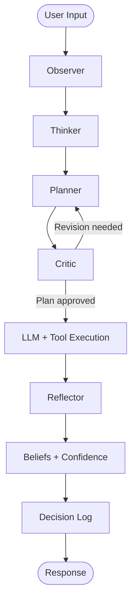
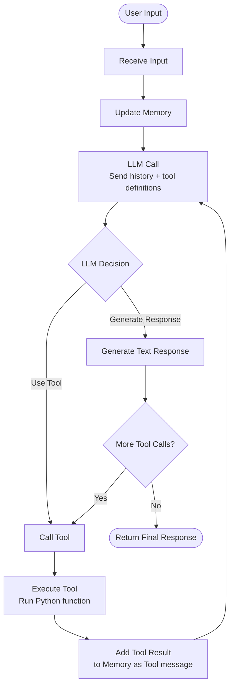

# Core Concepts

Iris Agent offers two levels of architecture. For structured reasoning, use the **cognitive pipeline** orchestrated by `Mind`. For simpler needs, the classic **agent loop** (`Agent`/`AsyncAgent`) is always available.

This page covers both, starting with the cognitive architecture.

---

# Cognitive Architecture

The `iris_agent.cognition` package provides a modular cognitive architecture inspired by Marvin Minsky's *Society of Mind* — intelligence emerges from the interaction of many specialized mental processes.

## Mind — The Cognitive Orchestrator

`Mind` (and `AsyncMind`) is the top-level orchestrator. Instead of a simple request-response loop, it runs a pipeline of **cognitive modules**:


```mermaid
flowchart TD
    Input([User Input]) --> Observer
    Observer --> Thinker
    Thinker --> Planner
    Planner --> Critic
    Critic -->|Plan approved| LLM[LLM + Tool Execution]
    Critic -->|Revision needed| Planner
    LLM --> Reflector
    Reflector --> Beliefs[Beliefs + Confidence]
    Beliefs --> Decisions[Decision Log]
    Decisions --> Output([Response])
```

**Pipeline stages:**

1. **Observer** — Converts raw input into structured Observations and Experiences. If `WorldModelAware`, it also extracts entities (file paths, URLs, tool mentions) into the Knowledge Graph.
2. **Thinker** — Selects applicable mental models (First Principles, OODA, SWOT, etc.) and injects their reasoning framework into the system prompt.
3. **Planner** — Decomposes the goal into a plan of action steps. If `WorldModelAware`, creates task entities linked to the current goal.
4. **Critic** — Self-evaluates the plan. If revision is needed, loops back to the Planner. When approved, proceeds to execution.
5. **LLM + Tool Execution** — The LLM generates responses and calls tools. Results are appended to memory.
6. **Reflector** — Post-action analysis. Records lessons learned and updates beliefs. If `WorldModelAware`, stores lesson entities in the Knowledge Graph.
7. **Belief Update** — `BeliefSystem` updates probabilistic beliefs with new evidence.
8. **Decision Log** — Records the decision for auditability.

### Example

```python
from iris_agent import LLMConfig, SyncLLMClient
from iris_agent.cognition import Mind

config = LLMConfig(provider="openai", model="gpt-4o-mini", api_key="sk-...")
client = SyncLLMClient(config)

mind = Mind(llm_client=client)
result = mind.run("What is the capital of France?")
print(result.response)       # "The capital of France is Paris"
print(result.confidence)     # 0.85
print(result.mental_model)   # "first_principles"
```

### MindResult

`Mind.run()` returns a `MindResult` with these fields:

| Field | Type | Description |
| :--- | :--- | :--- |
| `response` | `str` | Final text response |
| `confidence` | `float` | Estimated confidence (0–1) |
| `mental_model` | `str \| None` | The mental model selected by the Thinker |
| `context` | `dict` | Full cognitive context from all modules |
| `plan` | `list[dict] \| None` | The plan produced by Planner |
| `lessons` | `list[str]` | Lessons recorded by Reflector |
| `message_history` | `list[dict]` | Full LLM message history |

## Cognitive Modules

All modules inherit from `CognitiveModule` and implement `process(context) -> context`. They communicate via a shared context dict.

| Module | File | Purpose |
| :--- | :--- | :--- |
| **Observer** | `observer.py` | Input → Observation → Experience |
| **Thinker** | `thinker.py` | Mental model selection and execution |
| **Planner** | `planner.py` | Goal decomposition into plan steps |
| **Critic** | `critic.py` | Self-evaluation and revision |
| **Reflector** | `reflector.py` | Post-action analysis → lessons |
| **Attention** | `attention.py` | Focus / priority management |
| **Debate** | `debate.py` | Multi-perspective reasoning |
| **Simulation** | `simulation.py` | Counterfactual evaluation |
| **Learning** | `learning.py` | Strategy adaptation from experience |
| **HypothesisGenerator** | `hypothesis.py` | Hypothesis generation and testing |
| **BeliefSystem** | `beliefs.py` | Probabilistic beliefs with evidence tracking |
| **ConfidenceTracker** | `confidence.py` | Confidence estimation |
| **DecisionLog** | `decisions.py` | Decision recording |
| **ExperienceStore** | `experiences.py` | Experience creation and storage |
| **EventBus** | `events.py` | Simplified pub/sub for in-pipeline events |
| **KnowledgeGraph** | `graph.py` | Entity/Relation CRUD, traversal, serialization |
| **WorldModel** | `world_model.py` | Facade over KnowledgeGraph |
| **WorldModelAware** | `world_model_aware.py` | Mixin for modules needing graph access |
| **MentalModel** | `mental_models.py` | ABC + 6 built-in models |

## Mental Models

Mental models are reasoning frameworks that the Thinker selects and automatically injects into the system prompt. You never manually manage reasoning prompts.

| Model | Strategy |
| :--- | :--- |
| **First Principles** | Break down to fundamental truths, build up from there |
| **Root Cause Analysis** | Trace symptoms to root causes via 5 Whys |
| **OODA Loop** | Observe → Orient → Decide → Act |
| **SWOT** | Strengths, Weaknesses, Opportunities, Threats |
| **Second-Order Thinking** | Consider consequences of consequences |
| **Bayesian Updating** | Update beliefs with prior probability and new evidence |

## World Model & Knowledge Graph

The World Model replaces flat message history with a structured **Knowledge Graph** of typed entities and relations. This gives the agent persistent, queryable awareness across turns.

### Knowledge Graph

Entities are typed (goal, task, file, tool, message, etc.) and connected by typed relations (subgoal_of, depends_on, produces, references, etc.).

```python
from iris_agent.cognition import KnowledgeGraph

kg = KnowledgeGraph()

goal_id = kg.add_entity("goal", {"description": "Build a feature"})
task_id = kg.add_entity("task", {"description": "Implement API"})
kg.add_relation(task_id, goal_id, "subgoal_of")

related = kg.get_related(goal_id)
```

### WorldModel Facade

`WorldModel` wraps `KnowledgeGraph` with higher-level methods and is automatically integrated into `Mind`:

```python
wm = WorldModel()
wm.set_goal("Refactor code")
wm.ingest_message("user", "List all .py files in src/")
wm.add_task("Find all Python files")

context_summary = wm.get_context()
# "Current Goal: Refactor code\nKnown entities:\n  - [message] ..."
```

### How It Integrates

- **Observer** (WorldModelAware) — auto-extracts file paths, URLs, tool mentions from user input into the graph
- **Planner** (WorldModelAware) — creates task entities linked to the current goal
- **Reflector** (WorldModelAware) — records lesson entities after each run
- **World state appended to prompt** — `get_context()` output is injected into the system prompt

### Cross-Turn Persistence

WorldModel state persists across `mind.run()` calls via JSON files:

```python
mind = Mind(
    llm_client=client,
    world_model_path="./memory/world_model.json"
)
result = mind.run("First message")
result2 = mind.run("Second message")  # carries knowledge forward
```

---

# Underlying Engine

The cognitive pipeline is built on a robust, provider-agnostic engine. This same engine powers the simpler `Agent`/`AsyncAgent` for backward compatibility.

## The Agent Loop

At its simplest, the engine runs a loop that continues until the LLM produces a final answer:


```mermaid
flowchart TD
    Start([User Input]) --> Receive[Receive Input]
    Receive --> UpdateMemory[Update Memory]
    UpdateMemory --> LLMCall[LLM Call<br/>Send history + tool definitions]
    LLMCall --> Decision{LLM Decision}
    Decision -->|Generate Response| Respond[Generate Text Response]
    Decision -->|Use Tool| CallTool[Call Tool]
    CallTool --> Execute[Execute Tool<br/>Run Python function]
    Execute --> AddToolResult[Add Tool Result<br/>to Memory as Tool message]
    AddToolResult --> LLMCall
    Respond --> CheckToolCalls{More Tool Calls?}
    CheckToolCalls -->|Yes| CallTool
    CheckToolCalls -->|No| FinalOutput([Return Final Response])
```

This loop is used by both `Agent.run()` and `Mind`'s LLM + Tool Execution stage.

## LLM Clients

`SyncLLMClient` and `AsyncLLMClient` wrap the OpenAI Python SDK and share common behavior via `BaseLLMClient`.

### LLMConfig

| Field | Description |
| :--- | :--- |
| `provider` | `LLMProvider.OPENAI` or `LLMProvider.GOOGLE` |
| `model` | Model name (e.g., `"gpt-4o-mini"`) |
| `api_key` | API key |
| `base_url` | Optional override (local models, Gemini endpoint) |
| `reasoning_effort` | For reasoning models (o1, etc.) |
| `web_search_options` | For models that support web search |
| `extra_body` | Provider-specific overrides |

### Provider Compatibility

The clients work with OpenAI, Google Gemini (via OpenAI-compatible `base_url`), and any OpenAI-compatible API (Ollama, vLLM, LocalAI).

## Memory

Conversation history is a list of message dicts compatible with OpenAI's chat format:

```python
[
  {"role": "developer", "content": "You are a helpful assistant."},
  {"role": "user", "content": "What is the date?"},
  {"role": "assistant", "tool_calls": [...]},
  {"role": "tool", "tool_call_id": "...", "content": "2023-10-27"},
  {"role": "assistant", "content": "It is October 27, 2023."}
]
```

System prompts use role `developer` (OpenAI o-series compatible), not `system`.

## Messages & Roles

| Role | Usage |
| :--- | :--- |
| `DEVELOPER` / `SYSTEM` | System instructions (kept at index 0) |
| `USER` | Human input |
| `ASSISTANT` | AI responses (may include `tool_calls`) |
| `TOOL` | Function call results (must include `tool_call_id`) |

Use `create_message()` for properly formatted messages:

```python
from iris_agent import create_message, Role

user_msg = create_message(Role.USER, "What's the weather?")

image_msg = create_message(
    role=Role.USER,
    content="Describe this image",
    images=["https://example.com/photo.jpg"]
)
```

## Tools & ToolRegistry

Tools are Python functions with type hints. The `@tool` decorator automatically infers the JSON schema for the LLM.

```python
from iris_agent import tool, ToolRegistry

@tool
def calculate_tax(amount: float, rate: float = 0.1) -> float:
    """Calculate tax for a given amount."""
    return amount * rate

registry = ToolRegistry()
registry.register(calculate_tax)
```

This produces the schema automatically:

```json
{
  "name": "calculate_tax",
  "description": "Calculate tax for a given amount.",
  "parameters": {
    "type": "object",
    "properties": {
      "amount": {"type": "number"},
      "rate": {"type": "number"}
    },
    "required": ["amount"]
  }
}
```

### Core Built-in Tools

Quick-start with common file-system tools:

```python
tools = ToolRegistry()
tools.include_core()  # read_file, list_dir, glob_files, grep_files, run_command
```

Or import individually:

```python
from iris_agent import CORE_TOOLS  # dict of {name: function}

from iris_agent.tools import (
    core_read_file,
    core_list_dir,
    core_glob_files,
    core_grep_files,
    core_run_command,
)
```

### Async Tools

```python
@tool
async def fetch_url(url: str) -> str:
    """Fetch content from a URL."""
    async with httpx.AsyncClient() as client:
        response = await client.get(url)
        return response.text

registry.register(fetch_url)
result = await registry.call_async("fetch_url", url="https://example.com")
```

### Sharing Registries

```python
shared_tools = ToolRegistry()
shared_tools.register(calculate_tax)
shared_tools.register(fetch_url)

agent1 = Agent(llm_client=client1, tool_registry=shared_tools)
agent2 = Agent(llm_client=client2, tool_registry=shared_tools)
```

## PromptRegistry

Manage system prompts with support for static strings, templates, and callable prompts.

### Static Prompts

```python
registry = PromptRegistry()
registry.add_prompt("assistant", "You are a helpful AI assistant.")

agent = Agent(
    llm_client=client,
    prompt_registry=registry,
    system_prompt_name="assistant"
)
```

### Template Prompts

```python
registry.add_prompt("personal", "You are {name}'s assistant. Today is {date}.")
rendered = registry.render("personal", name="Alice", date="2024-01-15")
registry.add_prompt("alice", rendered)
```

### Callable Prompts

```python
def contextual_prompt(current_time: str, user_location: str) -> str:
    return f"You are a helpful assistant. Time: {current_time}, Location: {user_location}"

registry = PromptRegistry()
registry.add_prompt("contextual", contextual_prompt)
```

### Multiple Personas

```python
registry.add_prompt("friendly", "You are a friendly assistant.")
registry.add_prompt("professional", "You are a professional business assistant.")
registry.add_prompt("pirate", "You are a friendly pirate assistant. Arr!")

agent = Agent(
    llm_client=client,
    prompt_registry=registry,
    system_prompt_name="pirate"
)
```

## Tool Execution & Error Handling

When the LLM requests a tool call, the engine:
1. Parses and validates arguments against the schema
2. Executes the Python function
3. Captures errors and returns them to the LLM as tool messages, allowing retry

## Streaming

`run_stream()` yields tokens as they're generated and buffers tool calls for execution after the stream completes.

```python
# Sync
for chunk in agent.run_stream("Tell me a story."):
    print(chunk, end="", flush=True)

# Async
async for chunk in agent.run_stream("Tell me a story."):
    print(chunk, end="", flush=True)
```

## Advanced LLM Parameters

Pass to `run()` or `run_stream()`:

- `json_response` — Force JSON output (requires model support)
- `seed` — Deterministic output (for testing)
- `max_completion_tokens` / `max_tokens` — Response length limit
- `reasoning_effort` — For reasoning models (e.g., o1)
- `web_search_options` — Enable web search for supported models

## Logging

Enable Rich logging for colorized terminal output:

```python
agent = Agent(..., enable_logging=True)
```

Shows user messages, LLM calls, tool calls/results, and final responses with distinct colors.
