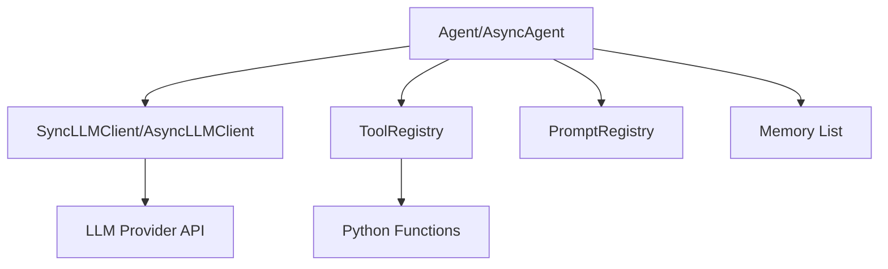

# Iris Agent Documentation

Welcome to the documentation for **Iris Agent**!

Iris Agent is a lightweight, flexible, and provider-agnostic framework for building AI agents in Python. It simplifies the process of creating agents that can use tools, manage memory, and interact with various LLM providers.

## Motivation

In the rapidly evolving landscape of AI development, many frameworks have grown increasingly complex, introducing heavy abstractions, custom DSLs (Domain Specific Languages), and "magic" that can obscure what's actually happening under the hood. While powerful, these "batteries-included" approaches often lead to:

- **Bloat**: Including massive dependencies and logic for features you don't use.
- **Opacity**: Making it difficult to debug prompts or understand exactly what is being sent to the LLM.
- **Rigidity**: Locking you into specific orchestration patterns (chains, DAGs) that may not fit your use case.

**Iris Agent** was built to be the antidote to framework fatigue. We encourage developers to **build only what you need**.

### Architectures as Blueprints for Thought

We believe that **an agent's architecture is effectively the blueprint of its thought process**. 

Different problems require different modes of cognition:
- **Simple Tasks**: Might need a straightforward `Prompt -> Response` chain.
- **Complex Reasoning**: Might require a `ReAct` (Reason+Act) loop or `Plan-and-Solve` strategy.
- **Creative Work**: Might benefit from a `Brainstorm -> Critique -> Refine` workflow.

Frameworks that lock you into a specific "Graph" or "Chain" structure often constrain how you can model this decision-making process. Iris Agent provides the primitive components—LLM clients, tool registries, memory stores—and lets **you** determine the cognitive architecture. 

Whether you are building a simple chatbot or a complex multi-step reasoning agent, the flow of control remains in standard, readable Python code.

### The Iris Difference: Transparency & Type Safety

The key thing that separates Iris Agent from other major frameworks is its **commitment to zero-overhead abstractions**. 

Instead of wrapping simple API calls in complex "Chains" or "Runnables", Iris Agent exposes the raw power of Python:
1.  **Standard Python Types**: Tools are defined using standard Python type hints, not complex configuration objects.
2.  **Direct Control**: You have full visibility into the message history and prompt construction.
3.  **No Hidden Magic**: If you want to customize the loop, you can. The framework gets out of your way.

## Key Features

- **Provider Agnostic**: Works with OpenAI, Google Gemini, or any OpenAI-compatible API (like LocalAI or vLLM).
- **Tool Support**: Easy-to-use `@tool` decorator that automatically infers JSON schemas from Python type hints.
- **Async & Sync**: First-class async and sync agents.
- **Streaming**: Built-in support for streaming responses for real-time applications.
- **Memory Management**: Automatic conversation history management with support for custom memory stores.
- **Prompt Management**: Centralized `PromptRegistry` for reusable and template-based system prompts.
- **Type Safety**: Built with strict type hints for better developer experience and tooling support.
- **Logging**: Integrated Rich logging for beautiful, readable debug output.

## Architecture Overview

Iris Agent is built around a few core components:



- **Agent**: The central controller that orchestrates the LLM, tools, and memory.
- **LLM Client**: Handles communication with the AI provider.
- **Tool Registry**: Manages available tools and executes them when requested by the model.
- **Prompt Registry**: Stores system instructions and templates.

## Quick Start

Here is a minimal example to get you running in seconds:

```python
from iris_agent import Agent, LLMConfig, LLMProvider, PromptRegistry, SyncLLMClient

# 1. Configure the LLM
config = LLMConfig(
    provider=LLMProvider.OPENAI,
    model="gpt-4o",
    api_key="sk-..."
)
client = SyncLLMClient(config)

# 2. Create a prompt registry and add a system prompt
prompts = PromptRegistry()
prompts.add_prompt("assistant", "You are a helpful AI assistant.")

# 3. Create the Agent with the system prompt
agent = Agent(
    llm_client=client,
    prompt_registry=prompts,
    system_prompt_name="assistant"
)

# 4. Run
response = agent.run("Hello! how are you doing today?")
print(response)
# I'm doing great! How about you?
```

## Documentation Map

Explore the detailed documentation:

- **[Getting Started](getting-started.md)**: Your first steps with Iris Agent.
- **[Installation](installation.md)**: Setup guide for different environments.
- **[Core Concepts](concepts.md)**: Deep dive into Agents, Tools, and Memory.
- **[How-To Guides](how-to.md)**: Practical recipes for common tasks (Tools, Streaming, etc.).
- **[Modules Reference](modules.md)**: Project structure overview.
- **[API Reference](api.md)**: Detailed class and function documentation.
- **[Examples](examples.md)**: Code examples for various use cases.
- **[Troubleshooting](troubleshooting.md)**: Solutions to common problems.
- **[FAQ](faq.md)**: Frequently asked questions.

## License

This project is licensed under the MIT License.
