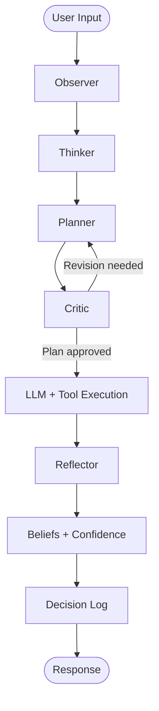
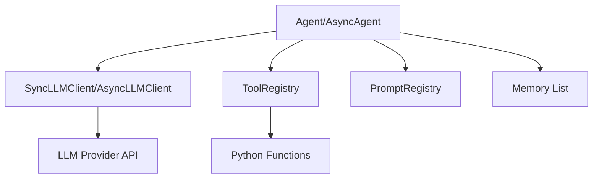

# Iris Agent Documentation

Welcome to **Iris Agent** — a modular cognitive architecture framework for building AI agents in Python.

Inspired by Marvin Minsky's *Society of Mind*, Iris Agent replaces rigid chains and graphs with a **pipeline of cognitive modules** — Observer, Thinker, Planner, Critic, Reflector — that work together like a society of specialized mental processes.

## Motivation

Most agent frameworks lock you into a specific orchestration pattern — chains, DAGs, or graphs. They grow complex, opaque, and rigid. Iris Agent takes a different approach: **the architecture is the blueprint of the agent's thought process.**

Different problems need different modes of cognition:

- **Simple tasks**: A straightforward `Prompt → Response` loop (use `Agent`).
- **Complex reasoning**: A structured pipeline with mental models, planning, and self-evaluation (use `Mind`).
- **Knowledge-aware tasks**: A cognitive pipeline backed by a persistent World Model and Knowledge Graph.

Iris Agent provides the primitive components — LLM clients, tool registries, cognitive modules — and lets **you** choose the right architecture for your problem.

### The Iris Difference

- **Transparency**: No hidden magic. You control prompt construction and message history.
- **Type Safety**: Tools are defined with Python type hints — JSON schemas are inferred automatically.
- **Zero Overhead**: No complex wrappers. The framework gets out of your way.

## Key Features

- **Cognitive Architecture**: 18 modular cognitive modules (Observer, Thinker, Planner, Critic, Reflector, etc.) orchestrated by `Mind`.
- **Mental Models**: Built-in reasoning frameworks (First Principles, OODA, SWOT, RCA, Bayesian) auto-injected into prompts.
- **World Model + Knowledge Graph**: Structured entity/relation graph replaces flat message history. Persists across turns via JSON.
- **Provider Agnostic**: OpenAI, Google Gemini, or any OpenAI-compatible API.
- **Tool Support**: `@tool` decorator with automatic JSON schema inference from type hints.
- **Async & Sync**: First-class support for both synchronous and asynchronous agents.
- **Streaming**: Built-in streaming for real-time applications.
- **Backward Compatible**: Existing `Agent`/`AsyncAgent` users are unaffected.

## Architecture Overview

Iris Agent offers two levels of architecture:

### Cognitive Pipeline (Mind)


```mermaid
flowchart TD
    Input([User Input]) --> Observer
    Observer --> Thinker
    Thinker --> Planner
    Planner --> Critic
    Critic -->|Plan approved| LLM[LLM + Tool Execution]
    Critic -->|Revision needed| Planner
    LLM --> Reflector
    Reflector --> Beliefs[Beliefs + Confidence]
    Beliefs --> Decisions[Decision Log]
    Decisions --> Output([Response])
```

The `Mind` orchestrator runs a pipeline of cognitive modules, each with a specialized role. The World Model provides structured knowledge that flows across turns.

### Simple Agent Loop (Agent)

For simpler use cases, the classic `Agent` loop remains available:


```mermaid
graph TD
    A[Agent/AsyncAgent] --> B[SyncLLMClient/AsyncLLMClient]
    A --> C[ToolRegistry]
    A --> D[PromptRegistry]
    A --> E[Memory List]
    B --> F[LLM Provider API]
    C --> G[Python Functions]
```

## Quick Start — Cognitive

```python
from iris_agent import LLMConfig, LLMProvider, SyncLLMClient
from iris_agent.cognition import Mind

config = LLMConfig(
    provider=LLMProvider.OPENAI,
    model="gpt-4o-mini",
    api_key="sk-..."
)
client = SyncLLMClient(config)

mind = Mind(
    llm_client=client,
    world_model_path="./world_model.json"
)

result = mind.run("Analyze the trade-offs between microservices and monoliths.")
print(result.response)
print(f"Confidence: {result.confidence}")
```

<details>
<summary>Quick Start — Simple Agent (legacy)</summary>

```python
from iris_agent import Agent, LLMConfig, LLMProvider, PromptRegistry, SyncLLMClient

config = LLMConfig(
    provider=LLMProvider.OPENAI,
    model="gpt-4o",
    api_key="sk-..."
)
client = SyncLLMClient(config)

prompts = PromptRegistry()
prompts.add_prompt("assistant", "You are a helpful AI assistant.")

agent = Agent(
    llm_client=client,
    prompt_registry=prompts,
    system_prompt_name="assistant"
)

response = agent.run("Hello! how are you doing today?")
print(response)
```

</details>

## Documentation Map

- **[Getting Started](getting-started.md)**: Build your first cognitive agent.
- **[Core Concepts](concepts.md)**: Deep dive into the cognitive pipeline, World Model, and underlying engine.
- **[How-To Guides](how-to.md)**: Practical recipes for tools, streaming, and cognitive features.
- **[Modules Reference](modules.md)**: Full list of cognitive modules and core components.
- **[API Reference](api.md)**: Detailed class and function documentation.
- **[Examples](examples.md)**: Code examples for various use cases.
- **[Roadmap](roadmap.md)**: What's coming next.
- **[FAQ](faq.md)**: Frequently asked questions.

## License

This project is licensed under the MIT License.
